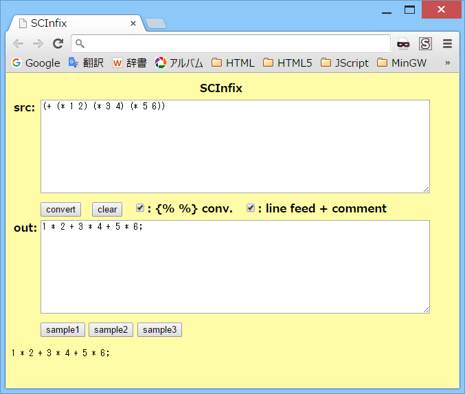

# SCInfix

## 概要
- 前置記法の数式を中置記法に変換を行うHTMLです。  
  前置記法の数式で使用可能な手続きは、Scheme(Gauche) を参考にしています。

- 実行例は、以下のページにあります。  
  https://hamayapp.appspot.com/static/scinfix.html

## 使い方
- scinfix.html を ブラウザで開くと起動します。

- srcのテキストボックスに前置記法の数式を貼り付けて、  
  convertボタンをクリックすると、中置記法に変換します。  
  結果は、outのテキストボックスに表示されます。  
  (その下にもデバッグ用に同じものが表示されます)

- また、「use { } conversion」のチェックボックスにチェックを入れると、  
  波括弧 { } 内の文字列は変換をしなくなります。

- clearボタンをクリックすると、入出力をすべてクリアします。

- sample1-3ボタンをクリックすると、変換の例を表示します。

## 注意事項
1. 前置記法の数式で、中置記法の演算子に対応している手続きについては、  
   HTML内の operator_data に設定内容が記述されています。  
   それ以外の手続きは、単に関数呼び出しに変換されます。  
   ( (func a b) → func(a,b) 等)

2. クォートされたリストは、配列に変換されます。  
   例えば '(1 2 3) は、[1,2,3] に変換されます。  
   (ただし、(quote 1 2 3) という記述には未対応です)  
   また、空のリスト ( ) は、空の配列 [ ] に変換されます。

3. 万能アクセサ ~ は、配列へのアクセスに変換されます。  
   例えば (~ a 1 2) は、a[1][2] に変換されます。

4. 前置記法の括弧は、( ) [ ] { } に対応しています。  
   ただし、括弧の種類の対応についてはチェックをしていません。  
   (例えば (+ 1 2] 等もエラーにはならない)  
   また、「use { } conversion」のチェックボックスにチェックを入れると、  
   波括弧 { } は、前置記法の括弧としては使用できなくなります。

5. 「use { } conversion」のチェックボックスにチェックを入れると、  
   波括弧 { } 内の文字列は変換をしなくなります。  
   波括弧の囲みは、変換時に外されて中身だけが出力されます。  
   ( {a-b-c} → a-b-c 等)  
   波括弧内で 波括弧の文字自身を表したい場合は、\\ でエスケープします( \\{ , \\} )。  
   また、\\ 自身を表したい場合は、\\\\ と記述します。

6. 現状、S式コメント #; には未対応です。

7. 現状、変換結果の中置記法の数式を、そのまま実行できる環境(言語)は存在しません。

## 環境等
- OS
  - Windows 8.1 (64bit)
- ブラウザ
  - Chrome v46

## 履歴
- 2015-10-29 v1.00 (初版)
- 2015-10-30 v1.01 一部処理見直し(不要行削除等)
- 2015-10-30 v1.02 書式修正のみ

(2015-10-30)
