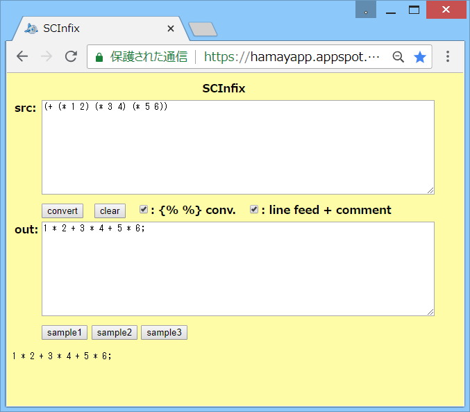

# SCInfix

## 概要
- 前置記法の数式を中置記法に変換を行うHTMLです。  
  前置記法の数式で使用可能な手続きについては、Scheme(Gauche) を参考にしています。

- 実行例は、以下のページにあります。  
  https://hamayapp.appspot.com/static/scinfix.html

## 使い方
- scinfix.html を ブラウザで開くと起動します。

- srcのテキストボックスに前置記法の数式を貼り付けて、  
  convertボタンをクリックすると、中置記法に変換します。  
  結果は、outのテキストボックスに表示されます。  
  (その下にも確認用に同じものが表示されます)

- また、「 conv.」のチェックボックスにチェックを入れると、  
   内の文字列は変換をしなくなります。

- また、「line feed + comment」のチェックボックスにチェックを入れると、  
  入力の改行とコメントを、変換結果に反映します。

- clearボタンをクリックすると、入出力をすべてクリアします。

- sample1-3ボタンをクリックすると、変換の例を表示します。

## 注意事項
1. 前置記法の数式で、中置記法の演算子に対応している手続きについては、  
   HTML内の operator_data に設定が記述されています。  
   それ以外の手続きは、単に関数呼び出しに変換されます。  
   ( (func a b) → func(a,b) 等)  
   現状では、lambda, let, cond 等の制御構造を持つような手続きを、  
   正常に変換することはできません。

2. クォートされたリストは、配列に変換されます。  
   例えば、'(1 2 3) は、[1,2,3] に変換されます。  
   また、空のリスト ( ) は、空の配列 [ ] に変換されます。

3. 万能アクセサ ~ は、配列へのアクセスに変換されます。  
   例えば、(~ a 1 2) は、a[1][2] に変換されます。

4. 前置記法の括弧は、( ) [ ] { } に対応しています。  
   ただし、括弧の種類の対応についてはチェックをしていません。  
   (例えば、(+ 1 2] 等もエラーにはならない)

5. 「 conv.」のチェックボックスにチェックを入れると、  
    内の文字列は変換をしなくなります。  
    の囲みは、変換時に外されて中身だけが出力されます。  
   (  → a-b-c 等)  
    内で { , } , % の文字を表したい場合は、\\ でエスケープしてください( \\{ , \\} , \\% )。  
   また、\\ 自身を表したい場合は、\\\\ と記述してください。

6. 現状、S式コメント #; には未対応です。

7. 現状、変数名等に演算子の記号を含めると、変換結果に問題が出るケースがあります。

8. 現状、変換結果の中置記法の数式を、そのまま実行できる環境(言語)は存在しません。

## 環境等
- OS
  - Windows 8.1 (64bit)
- ブラウザ
  - Chrome v46

## 履歴
- 2015-10-29 v1.00 (初版)
- 2015-10-30 v1.01 一部処理見直し(不要行削除等)
- 2015-10-30 v1.02 書式修正のみ
- 2015-10-30 v1.03 quote対応。エラー処理追加
- 2015-10-30 v1.04 改行反映フラグを追加
- 2015-10-31 v1.05 改行反映の不具合修正。演算子の前後に空白追加
- 2015-10-31 v1.06 一部処理見直し(make_output)
- 2015-10-31 v1.07 トークン分割のエスケープ処理修正等
- 2015-10-31 v1.08 一部処理見直し(トークン分割等)
- 2015-11-2  v1.09 単項の + - の優先順位対応  
  begin対応(カンマ演算子に変換)  
  比較演算子( < 等)の引数1個のみの場合をエラーにした
- 2015-11-2  v1.10 演算子 + - の処理の不具合修正
- 2015-11-2  v1.11 単項演算子の前の空白を削減
- 2015-11-3  v1.12 defineの引数処理見直し
- 2015-11-4  v1.13 改行処理見直し
- 2015-11-4  v1.14 不要変数削除
- 2015-11-6  v1.15 トークン分割処理修正。演算子の引数なし対応等
- 2015-11-6  v1.16 入力のコメントを変換結果に反映
- 2015-11-8  v1.17 名前の囲みを { } から  に変更  
  inc!,dec!の引数2個に対応  
  単項演算子の前の空白削減バグ修正
- 2015-11-8  v1.18 トークン分割処理一部修正

(2015-11-8)
